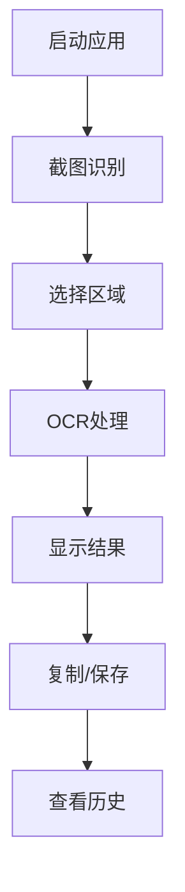

# XuanWu OCR 用户手册

欢迎使用 XuanWu OCR！这是一个功能强大的光学字符识别工具，支持多种OCR引擎和丰富的功能特性。

## 📖 手册目录

### 🚀 快速开始
- [安装指南](installation.md) - 软件安装和环境配置
- [快速入门](quick-start.md) - 5分钟上手指南
- [基础操作](basic-operations.md) - 核心功能使用方法

### ⚙️ 配置设置
- [配置概览](configuration.md) - 配置系统详细说明
- [OCR设置](ocr-settings.md) - OCR引擎和识别参数配置
- [界面设置](ui-settings.md) - 主题、字体、布局等界面配置
- [热键设置](hotkey-settings.md) - 快捷键自定义配置

### 🔧 高级功能
- [批量处理](batch-processing.md) - 批量OCR识别功能
- [历史记录](history-management.md) - 识别历史的管理和搜索
- [数据导出](data-export.md) - 识别结果的导出和格式转换
- [插件系统](plugins.md) - 插件安装和使用

### 🛠️ 开发者工具
- [开发者面板](developer-tools.md) - 调试和开发工具使用
- [日志系统](logging.md) - 日志查看和问题诊断
- [性能监控](performance.md) - 系统性能监控和优化

### 🌐 多语言支持
- [语言设置](language-settings.md) - 界面语言和OCR语言配置
- [本地化](localization.md) - 区域设置和格式配置

### ❓ 帮助支持
- [常见问题](faq.md) - 常见问题解答
- [故障排除](troubleshooting.md) - 问题诊断和解决方案
- [更新日志](changelog.md) - 版本更新记录

---

## 🎯 主要功能特性

### OCR 识别能力
- **多引擎支持** - 支持 Tesseract、PaddleOCR、EasyOCR 等主流引擎
- **多语言识别** - 支持中文、英文、日文、韩文等多种语言
- **高精度识别** - 智能预处理和后处理，提升识别准确率
- **实时识别** - 快速响应，实时显示识别结果

### 界面体验
- **现代化界面** - 简洁美观的用户界面设计
- **多主题支持** - 浅色、深色、自定义主题
- **响应式布局** - 适配不同屏幕尺寸和分辨率
- **无障碍支持** - 支持键盘导航和屏幕阅读器

### 数据管理
- **历史记录** - 完整的识别历史记录和搜索功能
- **数据导出** - 支持多种格式的数据导出
- **云端同步** - 可选的云端数据同步功能
- **数据安全** - 本地存储，保护用户隐私

### 扩展功能
- **批量处理** - 支持批量图片的OCR识别
- **插件系统** - 丰富的插件生态系统
- **API接口** - 提供编程接口，支持二次开发
- **自动化工具** - 支持脚本和自动化工作流

---

## 🚀 快速开始

### 第一次使用

1. **启动应用程序**
   - 双击桌面图标或从开始菜单启动 XuanWu OCR
   - 首次启动会进行初始化配置

2. **进行第一次OCR识别**
   - 按下 `Ctrl+Shift+S` 进行屏幕截图
   - 选择要识别的文本区域
   - 等待识别完成，查看结果

3. **查看识别结果**
   - 识别结果会显示在主窗口中
   - 可以复制、编辑或保存识别结果
   - 历史记录会自动保存

### 基本操作流程

---

## ⚙️ 系统要求

### 最低要求
- **操作系统**: Windows 10 / macOS 10.14 / Ubuntu 18.04
- **内存**: 4GB RAM
- **存储空间**: 500MB 可用空间
- **Python**: Python 3.8 或更高版本

### 推荐配置
- **操作系统**: Windows 11 / macOS 12 / Ubuntu 20.04
- **内存**: 8GB RAM 或更多
- **存储空间**: 2GB 可用空间
- **显卡**: 支持GPU加速（可选）

### 依赖组件
- **PyQt6** - 图形界面框架
- **OpenCV** - 图像处理库
- **Pillow** - 图像处理库
- **NumPy** - 数值计算库
- **OCR引擎** - Tesseract/PaddleOCR/EasyOCR

---

## 🔧 配置建议

### 新手用户
- 使用默认的 PaddleOCR 引擎
- 选择简体中文作为识别语言
- 启用图像预处理功能
- 使用默认的界面主题

### 高级用户
- 根据需求选择合适的OCR引擎
- 配置自定义热键组合
- 调整性能参数优化速度
- 自定义界面主题和布局

### 开发者
- 启用调试模式和详细日志
- 使用开发者工具面板
- 配置API接口和插件
- 启用性能监控功能

---

## 📞 获取帮助

### 在线资源
- **官方文档**: [https://xuanwu-ocr.readthedocs.io](https://xuanwu-ocr.readthedocs.io)
- **GitHub仓库**: [https://github.com/xuanwu-ocr/xuanwu](https://github.com/xuanwu-ocr/xuanwu)
- **问题反馈**: [GitHub Issues](https://github.com/xuanwu-ocr/xuanwu/issues)

### 社区支持
- **用户论坛**: 与其他用户交流使用经验
- **QQ群**: 123456789（XuanWu OCR用户群）
- **微信群**: 扫描二维码加入官方微信群

### 技术支持
- **邮箱支持**: support@xuanwu-ocr.com
- **在线客服**: 工作日 9:00-18:00
- **远程协助**: 预约技术支持服务

---

## 📝 使用条款

使用 XuanWu OCR 即表示您同意遵守以下条款：

1. **软件许可** - 本软件采用 MIT 许可证发布
2. **隐私保护** - 我们承诺保护用户数据隐私
3. **免责声明** - 软件按"现状"提供，不提供任何明示或暗示的保证
4. **使用限制** - 禁止将软件用于非法或有害目的

详细条款请参阅 [LICENSE](../../LICENSE) 文件。

---

## 🔄 版本信息

- **当前版本**: 2.1.7
- **发布日期**: 2024年1月
- **更新频率**: 每月定期更新
- **支持周期**: 长期支持版本

查看完整的 [更新日志](changelog.md) 了解版本变化。

---

*开始您的 XuanWu OCR 之旅！如有任何问题，请随时查阅本手册或联系我们的技术支持团队。*